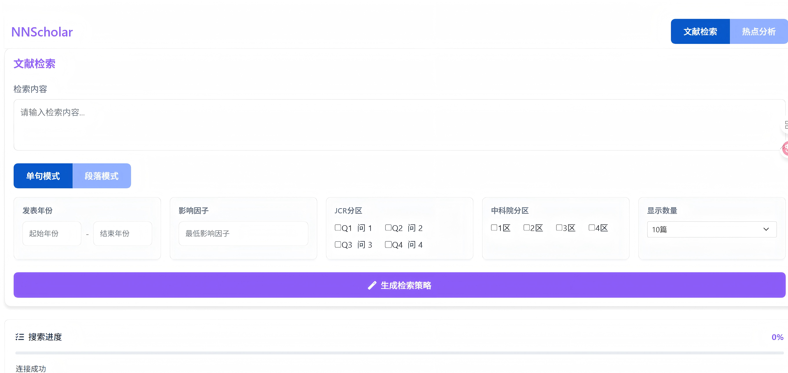

# 🧬 NNScholar - 智能学术文献检索与分析平台

> 基于AI驱动的学术文献检索、分析与综述生成工具

🔬 **NNScholar** 是一个集成了人工智能技术的学术文献检索与分析平台，专为科研工作者、学者和研究生设计。通过DeepSeek AI的强大分析能力，为用户提供智能化的文献检索、深度分析和学术写作支持。

## � 功能演示

**📺 [观看完整功能演示视频](https://youtu.be/ubyL7WJjn_I)**

通过视频演示，您可以直观了解：
- 💬 智能聊天界面的对话式检索体验
- 🔬 专业检索界面的高级功能
- 🤖 AI智能推荐系统的工作流程
- 📊 文献分析和导出功能的实际操作

## �🎯 双界面设计

### 💬 智能聊天界面 (`/chat`)
现代化的DeepSeek风格聊天界面，提供对话式的学术研究体验：

**特色功能：**
- 🤖 AI智能推荐系统
- 💬 对话式文献检索
- 📊 三层智能布局（检索摘要 → AI推荐 → 完整文献）
- 🔍 精确查找文献功能
- 📝 实时学术分析
- 💾 历史会话管理

### 🔬 专业检索界面 (`/`)
传统的专业检索界面，适合深度学术研究：

**特色功能：**
- 🎯 精准检索策略生成
- 📊 多维度筛选条件
- 📈 可视化数据分析
- 📚 基于文献的学术分析工具
- 📄 专业导出功能

## ✨ 核心功能

### 🔍 智能文献检索
- **AI驱动的检索策略生成**：基于DeepSeek AI自动生成优化的PubMed检索策略
- **双模式检索**：支持单句模式和段落模式检索
- **实时进度追踪**：详细的搜索进度显示和日志记录
- **智能相关性评分**：基于嵌入模型计算文献相关度
- **多维度筛选**：年份、影响因子、JCR分区、中科院分区等筛选条件

### 🤖 AI智能推荐系统
- **⭐ 代表性文章推荐**：基于影响因子、创新性和学术质量智能筛选最具价值的文献
- **🎯 智能推荐模块**：NNScholar科研助手为您推荐最重要的研究内容
- **🔍 精确查找文献**：从已检索文献中严格筛选符合特定要求的文献，支持充分性评分
- **📊 符合条件充分性评估**：按照90-100%（高度符合）、70-89%（中度符合）、50-69%（基本符合）进行评分排序

### 📊 学术分析功能
- **📈 全面研究现状分析**：基于检索文献生成详细的研究现状报告
- **📝 综述选题建议**：智能分析文献热点，提供综述写作选题
- **🔬 论著选题建议**：识别研究空白，提供原创研究方向
- **📚 完整综述生成**：自动生成结构化的文献综述文档
- **🚀 前沿研究方向**：发现最新研究趋势和热点
- **🧩 研究空白与机会**：识别未被充分研究的领域

### 🎯 期刊热点分析
- **热点主题识别**：分析期刊研究热点和趋势
- **可视化展示**：热力图、词云图、趋势图多维度展示
- **热点作者统计**：识别领域内高产作者和研究团队
- **时间序列分析**：追踪研究热点的时间变化

### 🛠️ 深度分析工具箱
- **AI投稿选刊**：基于研究内容智能推荐合适期刊
- **论文翻译**：专业的学术论文中英文翻译
- **论文润色**：学术写作语言优化
- **AI选题**：基于文献分析的研究选题建议
- **研究方法分析**：实验设计与统计分析指导
- **文献综述大纲**：综述结构分析与大纲生成
- **文献筛选**：精准筛选特定方向文献
- **创新点识别**：发现研究空白与创新方向
- **基金申请书撰写**：基于专业提示的基金申请指导

### 📄 数据导出
- **Excel表格导出**：包含影响因子、JCR分区、中科院分区的详细文献信息
- **Word文档导出**：格式化的文献报告，包含完整期刊质量信息
- **多格式支持**：支持初始检索和筛选后结果的分别导出

### 💬 现代化界面
- **DeepSeek风格聊天界面**：直观的对话式交互体验
- **历史会话管理**：保存和管理检索历史
- **响应式设计**：支持桌面和移动设备
- **实时状态反馈**：搜索进度、处理状态实时显示

## 🚀 快速开始

> 💡 **首次使用？** 建议先观看 [功能演示视频](https://youtu.be/ubyL7WJjn_I) 了解完整功能

### 环境要求
- Python 3.8+
- DeepSeek API密钥
- 嵌入模型API密钥

### 快速部署
1. 克隆项目并安装依赖
2. 配置API密钥
3. 启动应用
4. 访问界面：
   - 💬 **智能聊天界面**：`/chat` （推荐）
   - 🔬 **专业检索界面**：`/`

## 📖 使用指南

### 💬 智能聊天界面使用流程

**适用场景**：快速文献检索、对话式学术分析、日常研究查询

1. **对话式检索**
   - 直接输入研究问题或关键词
   - 支持自然语言描述，如"糖尿病治疗的最新进展"
   - AI自动理解意图并生成检索策略

2. **三层智能展示**
   - 📋 **检索摘要**：快速了解检索结果概况
   - 🤖 **AI推荐**：智能推荐最重要的代表性文献
   - 📚 **完整文献**：查看所有检索到的文献详情

3. **智能交互功能**
   - ⭐ **代表性文章推荐**：基于影响因子和创新性筛选
   - 🔍 **精确查找文献**：从结果中进一步精准筛选
   - 📊 **学术分析**：研究现状、选题建议、综述生成

### 🔬 专业检索界面使用流程

**适用场景**：深度学术研究、系统性文献调研、专业数据分析

1. **精准检索设置**
   - 详细的检索条件配置
   - 多维度筛选参数设置
   - 专业的检索策略定制

2. **高级分析功能**
   - 📈 **期刊热点分析**：分析特定期刊的研究趋势
   - 📊 **可视化展示**：热力图、词云图、趋势图
   - 🔬 **深度数据挖掘**：作者统计、时间序列分析

3. **专业导出功能**
   - 📊 **Excel表格**：包含影响因子、分区信息的详细数据
   - 📄 **Word文档**：格式化的文献报告
   - 📈 **图表导出**：可视化分析结果

### 🎯 期刊热点分析

1. **选择分析模式**
   - 切换到"热点分析"模式
   - 输入目标期刊名称

2. **设置分析参数**
   - 选择时间范围（起始年份-结束年份）
   - 可选择特定研究方向关键词

3. **获取分析结果**
   - 热点主题热力图
   - 关键词词云图
   - 研究趋势时间序列
   - 热点作者排名

### 🔍 精确查找文献

在完整文献列表下方，点击"🔍 精确查找文献"按钮：
1. **输入精确要求**：例如"和降糖药物相关研究"
2. **严格筛选标准**：系统会严格排除不符合要求的文献（如他汀类药物研究）
3. **充分性评分**：按照符合条件的充分性（90-100%、70-89%、50-69%）进行排序
4. **详细筛选理由**：每篇文献都有详细的符合筛选条件的理由说明

### 🛠️ 深度分析工具

访问聊天界面右上角的"🔬 深度分析"按钮，可使用：
- AI投稿选刊、论文翻译、论文润色
- AI选题、研究方法分析、文献综述大纲
- 文献筛选、创新点识别、基金申请书撰写
- 等覆盖学术研究全流程的工具

##  技术架构

### 核心技术
- **Python 3.8+** + **Flask** - 后端框架
- **DeepSeek AI** - 智能分析引擎
- **嵌入模型API** - 语义匹配计算
- **PubMed API** - 医学文献检索
- **Bootstrap 5** + **ECharts** - 前端界面

## 🔄 更新日志

### v2.1.0 (2025-06-27) - AI智能推荐系统
- ⭐ **代表性文章推荐**：基于影响因子、创新性和学术质量智能筛选最具价值的文献
- 🎯 **智能推荐模块**：NNScholar科研助手为您推荐最重要的研究内容
- 🔍 **精确查找文献**：从已检索文献中严格筛选符合特定要求的文献
- 📊 **充分性评分系统**：按照90-100%（高度符合）、70-89%（中度符合）、50-69%（基本符合）进行评分排序
- 🧠 **严格筛选标准**：宁可少选也不能错选，确保返回文献严格满足用户要求
- 🎨 **优化界面布局**：检索结果摘要 → AI推荐模块 → 完整文献列表的三层布局设计
- 🔧 **嵌入模型集成**：完全基于嵌入模型的相关度计算，提高语义匹配准确性

### v2.0.0 (2025-06-27) - 重大更新
- ✨ **全新DeepSeek风格聊天界面**：现代化的对话式交互体验
- 🤖 **AI驱动的文献分析**：集成DeepSeek AI进行智能分析
- 📊 **四大核心分析功能**：
  - 全面研究现状分析
  - 综述选题建议
  - 论著选题建议
  - 完整综述生成
- 🛠️ **深度分析工具箱**：覆盖学术研究全流程的9大工具
- 📄 **增强导出功能**：Word和Excel导出包含影响因子和分区信息
- 💬 **历史会话管理**：保存和管理检索历史
- ⚙️ **可自定义筛选设置**：用户可自定义文献筛选条件
- 🔧 **技术架构优化**：改进会话管理和缓存机制

### v1.x (2024)
- 🔍 基础文献检索功能
- 📈 期刊热点分析和可视化
- 📊 数据导出（Excel/Word）
- 🎯 实时搜索进度显示
- 📋 详细搜索日志记录
- 🔬 文献相关性计算优化

## 📞 支持与反馈

- **🎥 功能演示**: [观看完整功能演示视频](https://youtu.be/ubyL7WJjn_I)
- **GitHub Issues**: [提交问题](https://github.com/luckylykkk/nnscholar-search/issues)

---

**⭐ 如果这个项目对您有帮助，请给我们一个Star！**

Made with ❤️ by [luckylykkk](https://github.com/luckylykkk)

